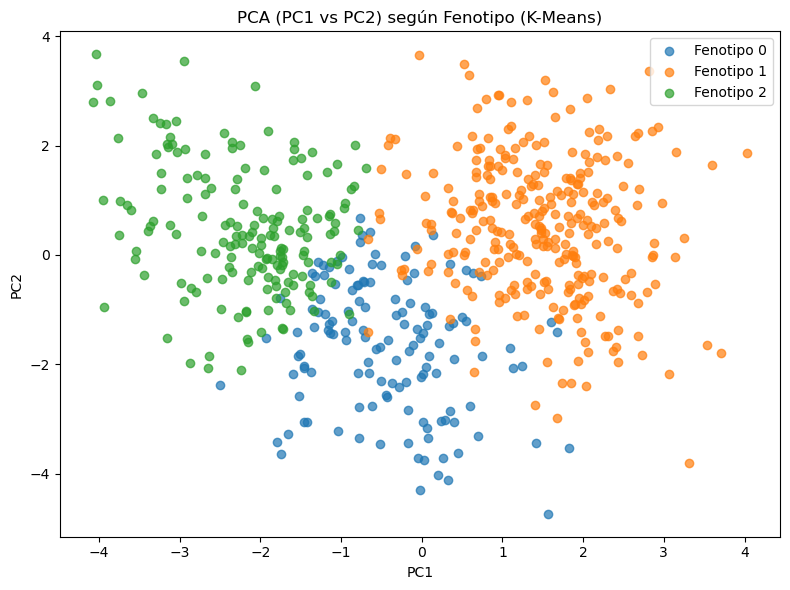
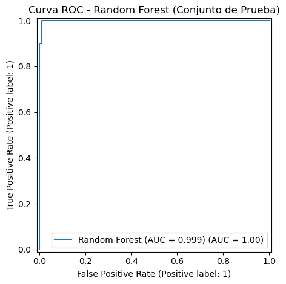

# Fenotipado y Predicción de Severidad en Datos de Alta Dimensionalidad

Este proyecto implementa un flujo completo de análisis en Python para datos de alta dimensionalidad, combinando técnicas de aprendizaje no supervisado y supervisado con el objetivo de identificar subgrupos latentes (fenotipos) y predecir severidad clínica.

---

## 1. Entorno de trabajo

- numpy: 2.1.3  
- pandas: 2.2.3  
- scikit-learn: 1.6.1  
- matplotlib: 3.10.0  

---

## 2. Descripción del dataset

Se simula un conjunto de datos con:

- 15 variables continuas (Feature_1 a Feature_15), representando biomarcadores y síntomas.
- Un outcome binario:
  - Severidad = 1 → Alta
  - Severidad = 0 → Baja

---

## 3. Preparación de los datos

### 3.1 Escalado
Las 15 variables predictoras son escaladas mediante `StandardScaler`, paso obligatorio para métodos basados en distancia y varianza.

---

## 4. Fenotipado no supervisado

### 4.1 Análisis de Componentes Principales (PCA)
Se aplica PCA reduciendo las 15 variables originales a dos componentes principales (PC1 y PC2) para visualización de la estructura del espacio de datos.

Varianza explicada:
- PC1: 0.212  
- PC2: 0.156  
- PC1 + PC2: 0.368  

### 4.2 PCA según Severidad
Visualización del espacio PC1–PC2 coloreado según el outcome real de severidad.

### 4.3 Clustering con K-Means
Se aplica K-Means sobre los datos escalados con `n_clusters = 3`.  
La etiqueta resultante se incorpora al dataset como variable `Fenotipo`.

Distribución de observaciones:
- Fenotipo 0: 136  
- Fenotipo 1: 293  
- Fenotipo 2: 171  

### 4.4 PCA según Fenotipo
Proyección de los tres fenotipos identificados en el plano PC1–PC2.

---

## 5. Modelado supervisado

### 5.1 Preparación
Se construye un modelo predictivo incorporando:
- Las 15 features originales
- La variable `Fenotipo`

Los datos se dividen en:
- 70% entrenamiento
- 30% prueba

### 5.2 Random Forest
Se entrena un modelo `RandomForestClassifier` con 300 árboles.

### 5.3 Evaluación
El rendimiento del modelo se evalúa mediante el Área Bajo la Curva ROC (AUC) en el conjunto de prueba.

AUC final: **0.999**

Curva ROC del modelo:

### 5.4 Importancia de variables
Las variables con mayor contribución al modelo incluyen:

- Feature_14  
- Fenotipo  
- Feature_6  
- Feature_4  
- Feature_12  

---

## 6. Reflexión y conclusión

El uso combinado de reducción de dimensionalidad, fenotipado no supervisado y modelos de ensamblaje permite identificar subgrupos latentes dentro de la población y mejorar sustancialmente la capacidad predictiva del modelo. Este enfoque resulta especialmente útil para la planificación de estudios clínicos, la estratificación de pacientes y el apoyo a la toma de decisiones en epidemiología moderna, siempre considerando validación externa y evaluación ética previa a su implementación.
